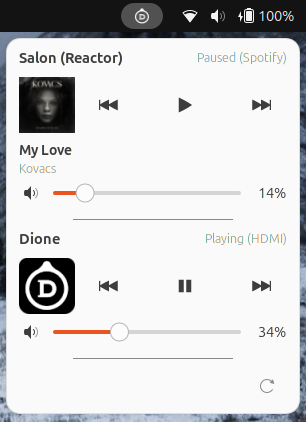

# Devialet Control — GNOME Shell Extension

A GNOME Shell extension to control Devialet speakers on your local network.



## Features

- **Automatic discovery** of Devialet speakers via mDNS (Avahi)
- **Per-device controls** — each speaker gets its own play/pause, previous, next buttons and volume slider
- **Now playing** — displays track title, artist and album artwork when available
- **Source type** — shows the active source (Spotify, AirPlay, Bluetooth, Optical, etc.)
- **Device cache** — previously discovered speakers appear instantly on startup
- **Background refresh** — devices that go offline are removed, new ones appear automatically

## Requirements

- GNOME Shell 46, 47 or 48
- Avahi (installed by default on most Linux distributions)

## Installation

```bash
ln -s /path/to/gnome-dvlt-ctrl ~/.local/share/gnome-shell/extensions/dvlt-ctrl@guzu.github.io
```

Restart GNOME Shell:
- **X11:** `Alt+F2` → type `r` → `Enter`
- **Wayland:** log out and log back in

Enable the extension:

```bash
gnome-extensions enable dvlt-ctrl@guzu.github.io
```

## Logs

```bash
journalctl -f -o cat /usr/bin/gnome-shell | grep dvlt-ctrl
```

## License

GNU General Public License v3.0
